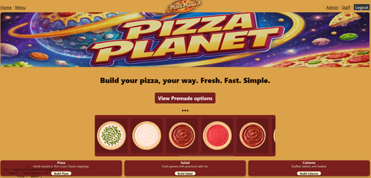
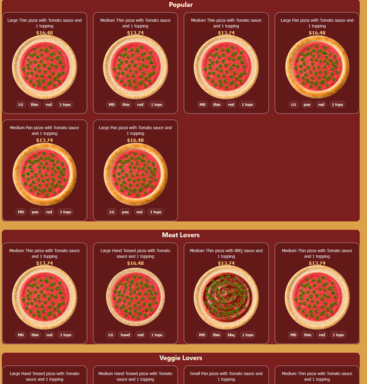
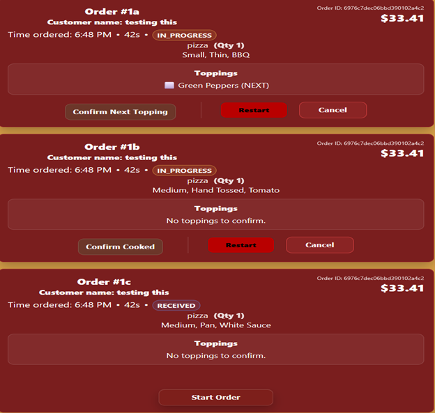
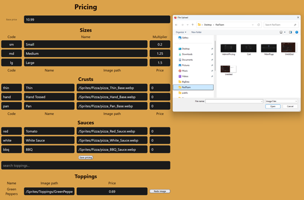

# Pizza Planet

## Description
The Gadget Saga continues with the best pizza in the galaxy! Pre-made options, or customize your pizza, salad, calzon

## Table of Contents
* [Technologies](#technologies)
* [Installation](#installation)
* [Usage](#usage)
* [Screenshots](#screenshots)
* [Contributors](#contributors)
* [Questions](#questions)
* [License](#license) 

## Technologies

- [`react`](https://react.dev) - Library for web and native user interfaces.
- [`vite`](https://vitejs.dev/) - Module bundler, transpiler and dev server.
- [`express`](https://expressjs.com)  - Framework with a robust set of features for web and mobile applications.
- [`mongoDB`](https://cloud.mongodb.com/) - Powerful, open source object-relational database system.
- [`bcrypt`](https://www.npmjs.com/package/bcrypt) - A library to help you hash passwords.
- [`JSON web tokens`](https://jwt.io/) - Open, industry standard RFC 7519 method for representing claims securely between two parties.
- [`docker`](https://www.docker.com/) - Containerization framework for dev and deployment.
- [`multer`](https://www.npmjs.com/package/multer) - Node.js middleware for handling multipart/form-data, which is primarily used for uploading files.

## Installation
1. This application was initialized with Vite, which automatically builds some boilerplate code, enabling faster startup of new projects.
2. After forking/cloning, ensure Docker Desktop is running.
3. In the terminal, at the root of the project, run 'docker run -d \
  --name pizza-mongo \
  -p 27017:27017 \
  -v pizza_mongo_data:/data/db \
  mongo:7' to start the docker container for mongoDB locally.
4. In the terminal, navigate to the client directory, run npm install, and then npm run dev.
5. In the terminal, navigate to the sercer directory, run npm install, and then npm run dev.
6. Navigate your browser to localhost:5173 to see the application running in your browser to interact with the features.

## Usage
For fans of deliciuos pizza to secure the bag. For Staff and Admin, a place to keep the business running.

## Screenshots

## Contributors
Matt Oravec (Software Engineer, SCRUM Master) || Brandon Bradway (Software Engineer, UI owner) || Kevin Foreman (Software Engineer, Architectural Owner, REPO Admin)

## Questions
Contact information (GitHub usernames) of the developers:
Matt O. || Brandon B. || Kevin F.

## License
The license used for this project is MIT.
For more information visit: https://opensource.org/license/mit/